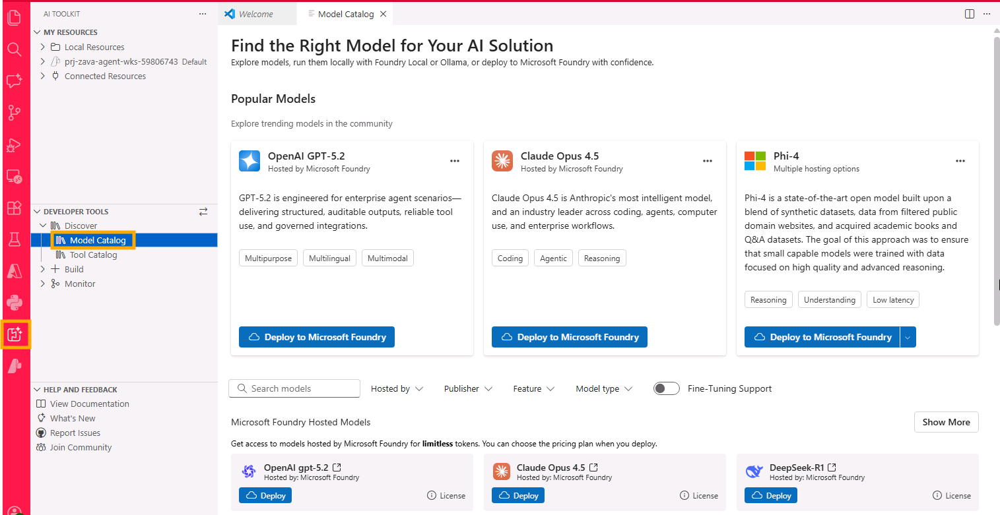
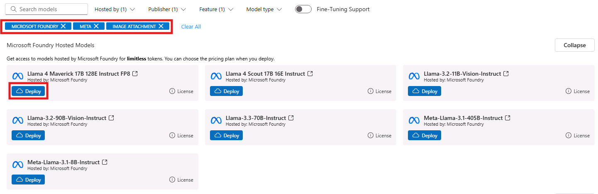
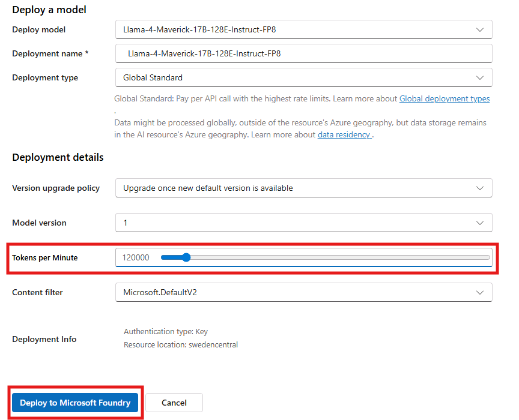
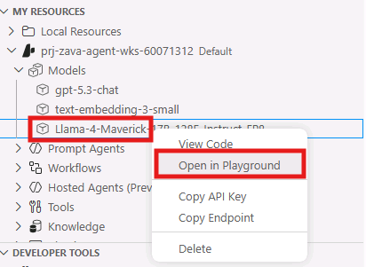
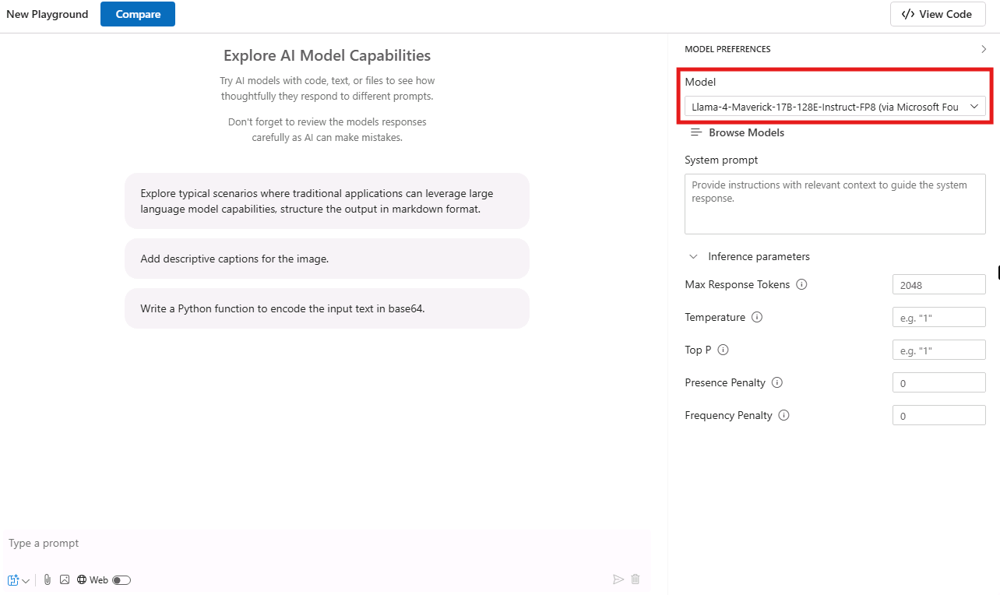
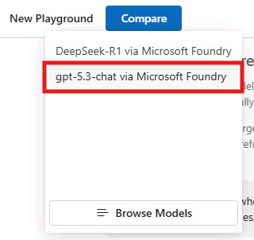
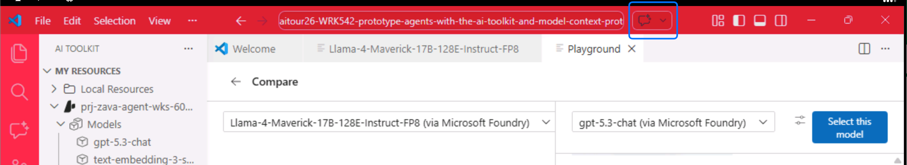
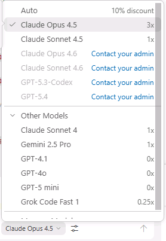
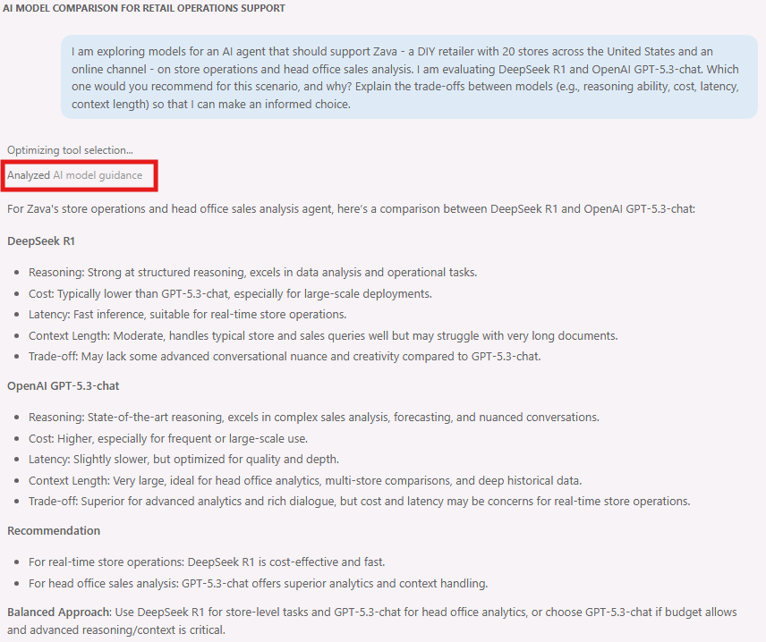
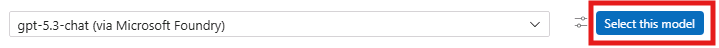

# モデル選択：AI Toolkit モデルカタログの探索

このセクションでは、AI Toolkit モデルカタログを使用して、マルチモーダルエージェントプロジェクトに適したモデルを検索、フィルタリング、比較します。モデルカタログでは、GitHub、Microsoft Foundry、OpenAI など、さまざまなプロバイダーのモデルにアクセスできます。

## ステップ 1：フィルターを適用して選択肢を絞り込む

1. 左サイドバーにある **AI Toolkit** 拡張機能のアイコンを見つけます
2. AI Toolkit アイコンをクリックして拡張機能パネルを開きます
3. **Developer Tools** の下にある **Discover** セクションを展開し、**Model Catalog** をクリックしてカタログインターフェースを開きます



ページの上部には最も人気のあるモデルが表示されます。下にスクロールすると、利用可能なモデルの全リストが表示されます。

リストは非常に多いため、フィルタリングオプションを使用して、要件に基づいて選択肢を絞り込むことができます。


### ホスティングプロバイダーでフィルタリング

1. **All Filters** フィルタードロップダウンをクリックして、`Hosted by` リストを表示します。GitHub（無料で使用できるトークンレート制限付きモデルを提供）、Microsoft Foundry、OpenAI など、いくつかのオプションがあります。また、Ollama や ONNX を通じて、ローカルインフラストラクチャでホストされているモデルも利用できます。

2. **Microsoft Foundry** を選択して、Microsoft Foundry でホストされているモデルを表示します。これらのモデルはエンタープライズグレードのセキュリティとコンプライアンス機能を提供しており、エンタープライズアプリケーションに最適です。

### パブリッシャーでフィルタリング

1. フィルターリストを下にスクロールして **Publisher** セクションに移動し、**Meta** を選択して、この主要プロバイダーのモデルを表示します。

### モデル機能でフィルタリング

1. フィルターリストを下にスクロールして **Feature** セクションに移動し、画像/音声処理、ビデオ処理、ツールコーリングなどのモデル機能でフィルタリングします。
2. **Image Attachment** を選択して、画像入力処理をサポートし、テキストと画像を組み合わせたマルチモーダルインタラクションを可能にするマルチモーダルモデルを検索します。

## ステップ 2：サブスクリプションにモデルをデプロイする

フィルターを適用すると、絞り込まれたモデルリストが表示されます。
フィルタリング結果から **Llama-4-Maverick-17B-128E-Instruct-FP8** を見つけます。これは優れた推論能力を持つマルチモーダルモデルです。

2. モデルタイルの **Deploy** をクリックして、デプロイメント構成ウィンドウを開きます。



3. **Token Per Minute** レートのスライダーを右にドラッグして 120K に増やします。その他のパラメータはデフォルトのままにして、**Deploy to Microsoft Foundry** をクリックし、サブスクリプションにモデルのインスタンスをプロビジョニングします。



## ステップ 3：テスト用にプレイグラウンドを開く

1. 左サイドバーの **My Resources** セクションを見つけ、Microsoft Foundry プロジェクト配下のリソースを展開します。
1. **Models** セクションの下に、先ほどデプロイしたモデルインスタンスが表示されているはずです。また、後の比較テスト用にプリデプロイされた **gpt-5.3-chat** のインスタンスと、次のセクションでベクトル検索と検索拡張生成（RAG）に使用する **text-embedding-3-small** のインスタンスも表示されているはずです。
1. 先ほどデプロイしたモデルインスタンスを右クリックし、ドロップダウンメニューから **Open in Playground** を選択して、プレイグラウンドインターフェースでモデルのテストを開始します。


2. **Model** フィールドに、先ほど選択したモデルの名前が表示されます。



> [!WARNING]
> 特にプレイグラウンドに初めてアクセスする場合、モデルの読み込みに時間がかかることがあります。モデルの初期化が完了するまでお待ちください。

3. 次に、**Compare** ボタンをクリックして、サイドバイサイド比較を有効にします
4. ドロップダウンから、このワークショップ用に Microsoft Foundry にプリデプロイされている **gpt-5.3-chat** デプロイメントを選択します
5. これで、2つのモデルが比較テストの準備完了です



## ステップ 4：テキスト生成とマルチモーダル機能をテストする

> [!TIP]
> サイドバイサイド比較を使用すると、異なるモデルが同じ入力をどのように処理するかを正確に確認でき、特定のユースケースに最適なモデルを選択しやすくなります。

まず、簡単なプロンプトでモデルとインタラクションを始めましょう：

1. テキストフィールド（「Type a prompt」というプレースホルダーが表示されている場所）に以下のプロンプトを入力します：

```
I'm a store manager at a DIY retailer. What are the most important metrics to review in a weekly sales summary, and why? Respond in Japanese.
```
2. 紙飛行機アイコンをクリックして、両方のモデルで同時にプロンプトを実行します


次に、以下のプロンプトで推論能力をテストします：
```
We have 3 stores (A, B, C). We only have 40 circuit breakers total across all stores and replenishment arrives in 10 days.

Here's a simple snapshot of sales trend and stock on hand:

| Store | Sales trend (WoW) | Avg weekly units sold | Current stock (units) |
|------:|-------------------:|----------------------:|----------------------:|
| A     | +30%              | 18                    | 8                     |
| B     | 0%                | 10                    | 22                    |
| C     | -15%              | 7                     | 10                    |

How should we allocate stock today to minimize stockouts and lost sales? Explain your reasoning step by step, and list the 3 most important additional data points you would ask for.

Respond in Japanese.
```

次に、モデルの画像処理能力をテストします：

1. テキストフィールドに以下のプロンプトを入力します：
```
In Japanese, describe what's in this image and what kind of electrical component it appears to be.
```

2. 画像添付アイコンをクリックして、入力として画像を追加します


3. 画像ファイルを選択するためのブラウジングウィンドウが表示されます。以下のパスに移動します：
```
C:\Users\LabUser\aitour26-WRK542-prototype-agents-with-the-ai-toolkit-and-model-context-protocol\src\instructions
```
次に、**circuit_breaker.png** という名前のファイルを選択して **Open** をクリックします。


4. 両方のモデルで同時にマルチモーダルプロンプトを送信します。

## ステップ 5：結果を分析・比較する

両方のモデルの出力を確認し、以下の要素を評価の指針として使用します：

- **レスポンスの品質**：説明の深さと正確性、および入力プロンプトとの一貫性を比較します。
- **詳細レベル**：どちらのモデルがより包括的な分析を提供するかを確認します。
- **処理時間**：レスポンス速度の違いに注目します。
- **出力フォーマット**：レスポンスの明確さと構成、および冗長性を評価します。モデルの冗長性はトークン使用量とコストに影響しますので注意してください。

### GitHub Copilot を活用した比較分析

比較分析を支援するために、GitHub Copilot を活用して比較サマリーを生成できます。

GitHub Copilot Chat にアクセスするには、Visual Studio Code ウィンドウの上部にある **Toggle Chat** アイコンを選択します。



「Auto」を選択し、次に「Other models」を選択します

> [!TIP]
> Claude Opus 4.5 モデルがメインリストに表示されない場合は、ドロップダウンの「Other models」セクションを展開して見つけてください。



> [!WARNING]
> ログインしていない場合、モデルを選択できません。前のラボセクションに記載されている GitHub Copilot サインインプロセスを完了しているか確認するか、プロンプトを送信してサインインフローをトリガーしてください。

Copilot チャットウィンドウで以下のプロンプトを試してください：

```
#mcp_azure_mcp_foundry I am exploring models for an AI agent that should support Zava - a DIY retailer with 20 stores across the United States and an online channel - on store operations and head office sales analysis. I am evaluating Llama-4-Maverick-17B-128E-Instruct-FP8 and OpenAI GPT-5.3-chat. Which one would you recommend for this scenario, and why? Explain the trade-offs between models (e.g., reasoning ability, cost, latency, context length) so that I can make an informed choice.
```

この質問に回答するために、Copilot は *Foundry MCP サーバー* ツールを利用します。このツールは、ユースケースに基づいたモデル推奨を提供します。Copilot が Foundry MCP サーバーツールへのアクセス許可を求めてきた場合は、**Allow in this session** をクリックして続行してください。Copilot が分析に必要な情報を収集するために複数のツールにアクセスする必要がある場合、これが複数回発生することがあります。



最終的なレスポンスでは、2つのモデルの詳細な比較と、AI エージェントプロジェクトに最適なモデルの推奨が表示されます。

## ステップ 6：Microsoft Foundry から選択したモデルをインポートする

比較が完了したら、次のラボセクションでさらにプロトタイピングを行うために、2つのモデルのうち1つを選択します。この演習では、**GPT-5.3-chat** を使用します。

> [!TIP]
> 標準のプレイグラウンド（単一ペイン、単一モデル）に戻るには、モデル名の右側にある **Select this model** をクリックします。
>
> 

## 主なポイント

- モデルカタログは、複数のプロバイダーから利用可能な AI モデルの包括的なビューを提供します
- フィルタリング機能により、特定の要件に合致するモデルを迅速に特定できます
- プレイグラウンドでのモデル比較により、データに基づいた意思決定が可能になります
- 異なるホスティングオプションは、開発の各段階に応じたさまざまなメリットを提供します
- マルチモーダル機能は、組み込みの比較ツールを使用して効果的にテストできます

この探索プロセスにより、パフォーマンス、コスト、機能、デプロイメント要件などの要素のバランスを取りながら、特定のユースケースに最適なモデルを選択できます。
次のラボセクションに進むには、**Next** をクリックしてください。
