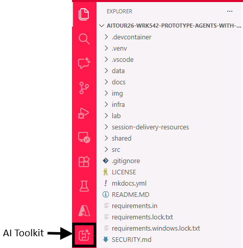
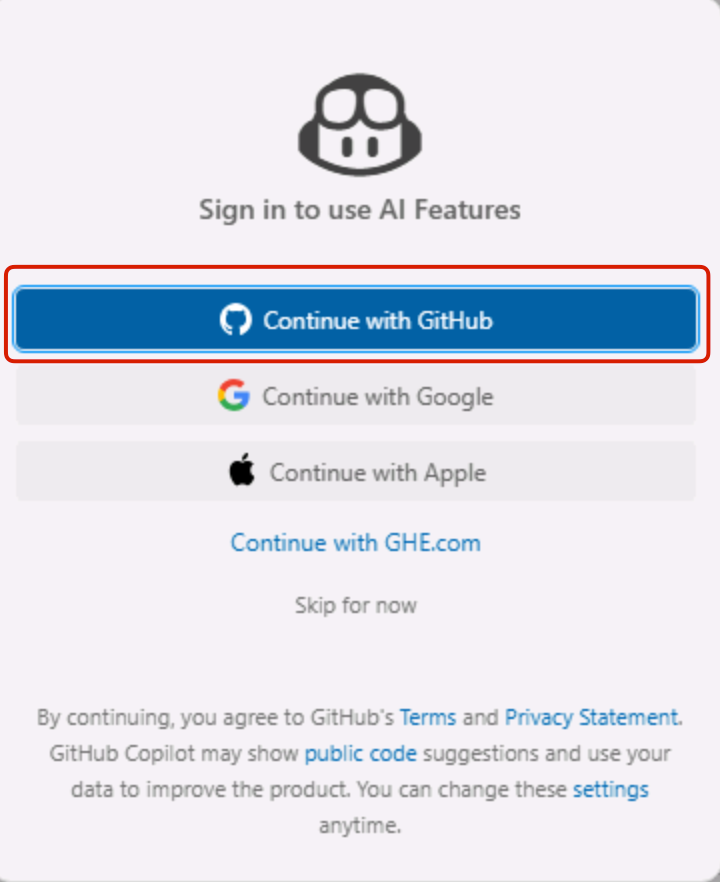
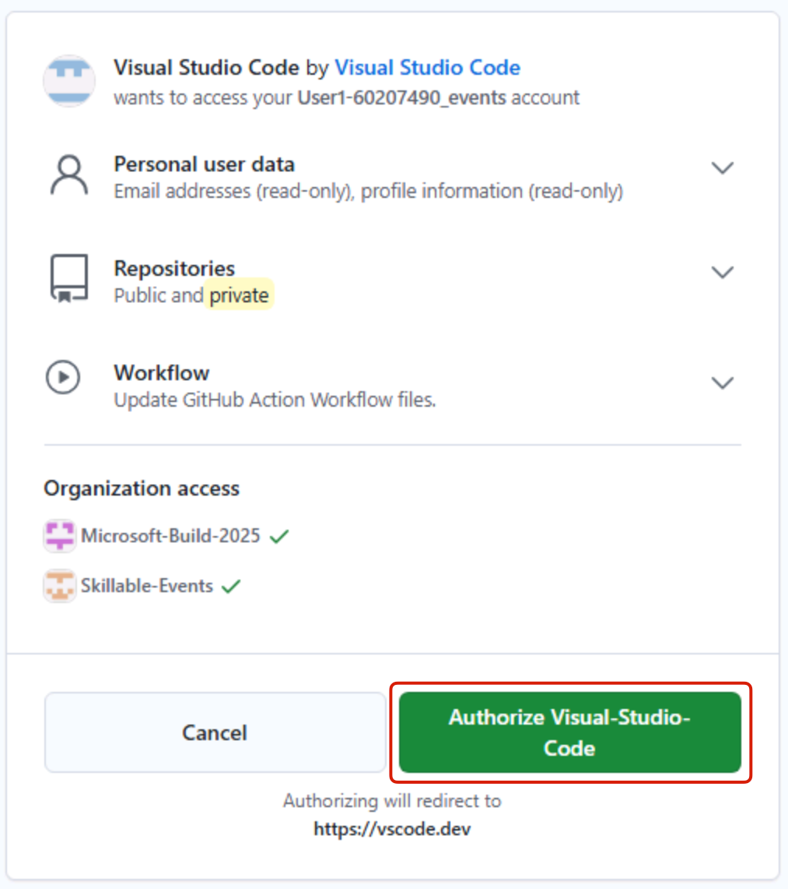

# 시작하기

> [!TIP]
> **AI Toolkit(AITK)**이란 무엇인가요? [AI Toolkit (AITK)](https://code.visualstudio.com/docs/intelligentapps/overview)은 Visual Studio Code용 확장으로, 다양한 AI 모델과 서비스를 하나의 통합된 인터페이스에서 접근하고 상호작용할 수 있게 해줍니다. GitHub, Microsoft Foundry 등 여러 플랫폼에서 호스팅되는(또는 로컬에서 실행되는) 독점/오픈소스 모델을 손쉽게 탐색, 비교, 활용할 수 있습니다. AITK를 사용하면 모델 선택, 프롬프트 엔지니어링, 에이전트 프로토타이핑 및 테스트를 코드 편집기 안에서 바로 수행할 수 있어 생성형 AI 개발 워크플로를 효율화할 수 있습니다.

## Windows에 로그인

먼저 **Resources** 탭의 Skillable VM 이름 아래에서 확인할 수 있는 자격 증명으로 실습용 가상 머신(VM)에 로그인합니다.


> [!TIP]
> **Skillable**이 처음인가요? “T” 아이콘(예: +++Admin+++)은 VM에서 현재 커서 위치에 값을 한 번의 클릭으로 자동 입력해 주는 기능입니다. 입력 노력을 줄이고 입력 오류를 최소화할 수 있습니다.
> 또한 필요하면 이미지를 클릭해서 확대할 수 있습니다.

## GitHub에 로그인

이 워크숍에서는 GitHub Enterprise(GHE) 계정을 사용해 AI Toolkit Model Catalog의 GitHub-hosted 모델에 접근하고, Visual Studio Code에서 GitHub Copilot 기능을 사용합니다.

아래 안내에 따라 제공된 GitHub Enterprise(GHE) 계정으로 로그인합니다.

1. 작업 표시줄에서 Edge 브라우저를 엽니다. 이미 [GHE 로그인 페이지](https://github.com/enterprises/skillable-events)가 열려 있는 탭이 표시됩니다.

2. **Continue**를 클릭하고 아래 자격 증명으로 로그인합니다.
   - Username: +++@lab.CloudPortalCredential(User1).Username+++
   - TAP: +++@lab.CloudPortalCredential(User1).TAP+++

*Skillable Events* GitHub 조직의 **Overview** 페이지가 보이면 정상적으로 로그인된 것입니다. 브라우저 탭은 숨기고 Visual Studio Code에서 워크숍 환경을 여는 단계로 진행합니다.

## Visual Studio Code에서 워크숍 환경 열기

다음 단계로 Visual Studio Code에서 워크숍 환경을 엽니다.
화면 하단 작업 표시줄에서 터미널 아이콘을 클릭해 터미널을 엽니다.


아래 명령 블록을 터미널에 복사/붙여넣기한 뒤 **Enter**를 누릅니다. 이 명령 블록은 워크숍 리포지토리를 업데이트하고, Python 가상 환경을 활성화하고, VS Code에서 프로젝트를 엽니다.

```powershell
; cd $HOME\aitour26-WRK542-prototype-agents-with-the-ai-toolkit-and-model-context-protocol\ `
; git pull `
; Remove-Item -Recurse -Force .git `
; .\.venv\Scripts\activate `
; $env:OTEL_SDK_DISABLED="true" `
; code .
```

> [!NOTE]
> 터미널에 여러 줄을 붙여넣는다는 경고가 표시됩니다. **Paste anyway**를 클릭해 진행합니다.

## Azure에 인증

Visual Studio Code에서 AI Toolkit 확장이 이미 설치되어 있는 것을 확인할 수 있습니다. AI Toolkit 아이콘을 클릭하여 사이드바를 엽니다.



> [!TIP]
> AITK 아이콘이 보이지 않으면 사이드바 하단의 말줄임표(...)를 클릭해 설치된 확장 목록 전체를 확인하세요.

> [!WARNING]
> 실습 문서의 일관성과 예기치 못한 문제를 방지하기 위해 VS Code 확장 자동 업데이트가 비활성화되어 있습니다. 실습 중에는 확장을 업데이트하지 마세요.

다음으로 **Set Default Project** -> **Sign in to Azure**를 클릭합니다.

<!---->

Azure 로그인 확인 팝업이 표시되면 **Allow**를 클릭합니다.


이후 로그인 절차를 완료하기 위한 창으로 이동합니다. 아래 자격 증명을 입력합니다.
- Email: +++@lab.CloudPortalCredential(User1).Username+++
- TAP: +++@lab.CloudPortalCredential(User1).TAP+++

> [!NOTE]
> 디바이스에서 모든 데스크톱 앱과 웹사이트에 자동으로 로그인하도록 허용할지 묻는 확인이 표시됩니다. **Yes**를 클릭해 진행합니다.

다시 VS Code로 돌아오면 사용할 Foundry 프로젝트를 선택하라는 안내가 표시됩니다. 이 워크숍을 위해 미리 배포된 유일한 프로젝트 옵션을 선택합니다.


로그인이 성공하면 **My resources** 아래에 프로젝트가 표시됩니다. 여기에서 모델, 에이전트, 도구 등의 리소스를 접근하고 관리할 수 있습니다.

## GitHub Copilot AI 기능 활성화

이 워크숍에서는 개발 작업을 돕기 위해 Visual Studio Code의 GitHub Copilot AI 기능도 사용합니다. GitHub Copilot을 사용하려면, 앞에서 Edge 브라우저에서 사용한 것과 동일한 GitHub Enterprise(GHE) 계정으로 로그인해야 합니다. 아래 단계에 따라 GitHub Copilot에 로그인합니다.

1. VS Code 창 오른쪽 아래 모서리에서 "Signed out" 텍스트와 함께 표시되는 **Copilot** 아이콘을 클릭합니다.
1. 다음으로 **Sign in to use AI features** -> **Continue with GitHub**를 클릭합니다.

    

    Then select `Continue with GitHub`

    

1. 새 브라우저 탭이 열리며 VS Code 권한 부여를 요청합니다. **Continue with GitHub**를 클릭해 이전과 동일한 GHE 계정으로 로그인합니다.

    

    다음 창에서 **Authorize Visual Studio Code**를 클릭합니다.

    

1. `Open`을 선택해 계속 진행합니다.

<!-- ## Got issues when logging in with GitHub?

> [!NOTE]
> If you are properly logged in with the GHE account as per previous step, please ignore this section and move to the next one.

If you encounter issues when logging in with the given GHE account, you can always use your own, by following the steps below:

1. Navigate to the [GitHub repo](https://aka.ms/msignite25-lab512) hosting the lab code and resources. 

    > [!TIP]
    > Click the Star button in the top right corner, this will help you easily find it later.

2. To launch a codespace, you need a **GitHub account**. 

    > [!NOTE]
    > If you already have a GitHub account, you can move to step 3 directly.

    To create one, click on the **Sign up** button and follow the instructions below:
    - In the new window, enter a personal email address, create a password, and choose a username.
    - Select your Country/Region and agree to the terms of service.
    - Click on the **Create account** button and wait for the verification email to arrive in your inbox.

    

    - Copy the verification code from the email and paste it into the verification field on the GitHub website. Then click on **Continue**.
    - Once the account is created, you'll be redirected back to the GitHub repo page and you'll see a green banner at the top, like the one in the screenshot below.

    

> [!WARNING]
> If your personal GitHub account is a free-tier one, you will have some limitations in the range of GitHub-hosted models you can access in the AI Toolkit Model Catalog. For example, you won't be able to use the GPT-5 family of models. You can still proceed with the lab using available models (recommended: OpenAI gpt-4.1).

3. Click on **Sign in** and enter your GitHub credentials to log in. If you just created your account, use the username and password you set during the sign-up process. -->

## 시작할 준비 완료

이로써 Visual Studio Code에서 AI Toolkit과 Microsoft Foundry 호스팅 모델을 사용하기 위한 필수 설정이 모두 끝났습니다. 이제 Model Catalog를 탐색하고 모델과 상호작용을 시작합니다.
Click **Next** to proceed to the following section of the lab.
